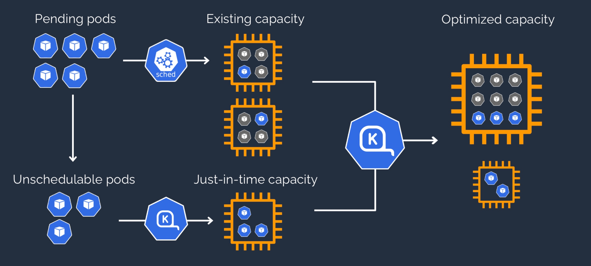

# Configure Cluster AutoScaling using Karpenter on Amazon EKS with Hashicorp Terraform
[](https://travis-ci.org/joemccann/dillinger)

## Architecture


## Prerequisites

Before you build the whole infrastructure you will need to meet the following pre-requisites.

### AWS account

Ensure you have access to an AWS account, and a set of credentials with *Administrator* permissions. **Note:** In a production environment we would recommend locking permissions down to the bare minimum needed to operate the pipeline.
<!--
### Create an AWS Cloud9 environment

Log into the AWS Management Console and search for Cloud9 services in the search bar. Click Cloud9 and create an AWS Cloud9 environment in the `us-east-1` region based on Amazon Linux 2. You can select the instance type as t2.micro.

### Configure the AWS Cloud9 environment

Launch the AWS Cloud9 IDE. Close the `Welcome` tab and open a new `Terminal` tab.


### Create and configure AWS Cloud9 environment
Log into the AWS Management Console and search for Cloud9 service in the search bar.

Click Cloud9 and create an AWS Cloud9 environment in the us-east-1 region based on Amazon Linux 2. Create an IAM role for Cloud9 workspace as explained [here](https://www.eksworkshop.com/020_prerequisites/iamrole/). Attache the IAM role to your workspace as explained [here](https://www.eksworkshop.com/020_prerequisites/ec2instance/). Turn off the AWS managed temporary credentials of the Cloud9 environment as explained [here](https://www.eksworkshop.com/020_prerequisites/workspaceiam/). 
- You can also resize the Amazon Elastic Block Store (Amazon EBS) volume that is associated with an Amazon EC2 instance for an environment. The detailed steps are documented [here](https://docs.aws.amazon.com/cloud9/latest/user-guide/move-environment.html#move-environment-resize).

- Use File/Upload Local Files ... from the Cloud9 menu to upload the code sample files ino the AWS Cloud9 environment.

Open a new terminal in Cloud9 and install jq using the command:

```bash
unzip workshop.zip
```
-->
### Upgrade awscli
To ensure you are running the latest version of AWS CLI, run the following command:

```bash
aws --version
pip install awscli --upgrade --user
```

Run `aws configure` to configure your region. Leave all the other fields blank. You should have something like:

```
aws configure --profile aws-karpenter
AWS Access Key ID [None]: xxxxxxxxxxxx
AWS Secret Access Key [None]: xxxxxxxxxxxxxxx
Default region name [None]: us-east-1
Default output format [None]: 

export AWS_DEFAULT_PROFILE=aws-karpenter
```

#### Install Terraform

Download and install Terraform:

```bash
sudo yum install -y yum-utils
sudo yum-config-manager --add-repo https://rpm.releases.hashicorp.com/AmazonLinux/hashicorp.repo
sudo yum -y install terraform
```

Verify that you can run Terraform:

```bash
terraform version
```

#### Install kubectl

For detailed installation instructions, follow the documentation [here](https://docs.aws.amazon.com/eks/latest/userguide/install-kubectl.html).

#### Install helm

For detailed installation instructions, follow the documentation [here](https://docs.aws.amazon.com/eks/latest/userguide/helm.html).

####  Installing aws-iam-authenticator

For detailed installation instructions, follow the documentation [here](https://docs.aws.amazon.com/eks/latest/userguide/install-aws-iam-authenticator.html)

#### Clone the repository

Clone the source code repository:

```bash
cd ~/environment
git clone https://github.com/aws-samples/aws-eks-karpenter-terraform-cloud.git
```

## Build the infrastructure and Amazon EKS with Karpenter

We shall use Terraform to build the above architecture including the Amazon EKS.

**Note:** This infrastructure will create chargeable resources in your account. When finished, please make sure you clean up resources as instructed at the end.

Open env.sh file and set the value of the AW profile.

```bash
export profile="xxxxxx"
```
Open a terminal and run the following commands.

```bash
cd aws-eks-karpenter-terraform-cloud/terraform
terraform init
./apply.sh
```
```bash
export AWS_DEFAULT_PROFILE=xxxxxx
```

```bash
kubectl get nodes
kubectl get pods -A
```

### Execute only if this is the first time using spot instances in this account
```bash
aws iam create-service-linked-role \
    --aws-service-name spot.amazonaws.com
```

### Create Karpenter provisioner

```bash
kubectl apply \
    --filename ../provisioner/provisioner.yaml

kubectl get pods,nodes

kubectl --namespace karpenter logs \
    --selector karpenter=controller
```

### Create a deployment

```bash
kubectl apply -f ../deployment/deployment.yaml

kubectl get pods,nodes
```

### Open three terminals

```bash
Terminal#1
export AWS_DEFAULT_PROFILE=xxxxxx
watch -t -n 1 'kubectl get pods'

Terminal#2
export AWS_DEFAULT_PROFILE=xxxxxx
watch -t -n 1 kubectl get no -Lnode.kubernetes.io/instance-type -Ltopology.kubernetes.io/zone -Lkubernetes.io/arch

Terminal#3
export AWS_DEFAULT_PROFILE=xxxxxx
kubectl logs -f -n karpenter $(kubectl get pods -n karpenter -l karpenter=controller -o name)

```

### Scale up the deployment

```bash
kubectl scale deployment inflate --replicas 10
```
### Scale down the deployment

```bash
kubectl scale deployment inflate --replicas 0
```

## Destroy the infrastcructure

```bash
cd aws-eks-karpenter-terraform-cloud/terraform
./destroy.sh
```


<!--
## Setup Terraform Cloud
Terraform Cloud is an application that manages Terraform runs in a consistent and reliable environment instead of on your local machine. It stores shared state and secret data, and connects to version control systems so that you and your team can work on infrastructure as code within your usual code workflow. It also has a private registry for sharing Terraform modules.


### Create an account

Visit https://app.terraform.io/signup/account and follow the prompts to create a free Terraform Cloud account.


When you sign up, you'll receive an email asking you to confirm your email address. Confirm your email address before moving on.

### Create an organization

After you create your account, the Terraform Cloud Web UI will prompt you to create a new organization. Your organization is free, and the members you add will be able to collaborate on your workspaces and share private modules.

Enter aws-terraform as organization name and an email address. You can use the same email address that you used for your account.


### Create a workspace

Workspaces determine how Terraform Cloud organizes infrastructure. 


Click CLI-driven workflow.


Enter **aws-eks-karpenter-terraform-cloud** as the Workspace Name and click **Create workspace**.


Copy the Example code and paste it inside the provider.tf file.

### Configure AWS credentials

Click the **Variables** tab at the top to create **Terraform Variables** AWS_DEFAULT_REGION and **Environment Variables** AWS_ACCESS_KEY_ID, AWS_SECRET_ACCESS_KEY.


### Terraform login

Using Cloud9 environment, open a new Terminal and use the following command:

```bash
terrafom login
```
At the prompt, enter yes and follow the instructions to generate a token using the url : https://app.terraform.io/app/settings/tokens?source=terraform-login.

Terraform will store the token in this file: 
```bash
/home/ec2-user/.terraform.d/credentials.tfrc.json
```


## Provision infrastructure using Terraform Cloud

### Terraform CLI

Inside the Cloud9 terminal run:

```bash
cd ~/environment/aws-eks-karpenter-terraform-cloud/terraform
terraform init
```


```bash
terraform plan
./apply.sh
```


Here are the results of the **terraform apply**


-->


